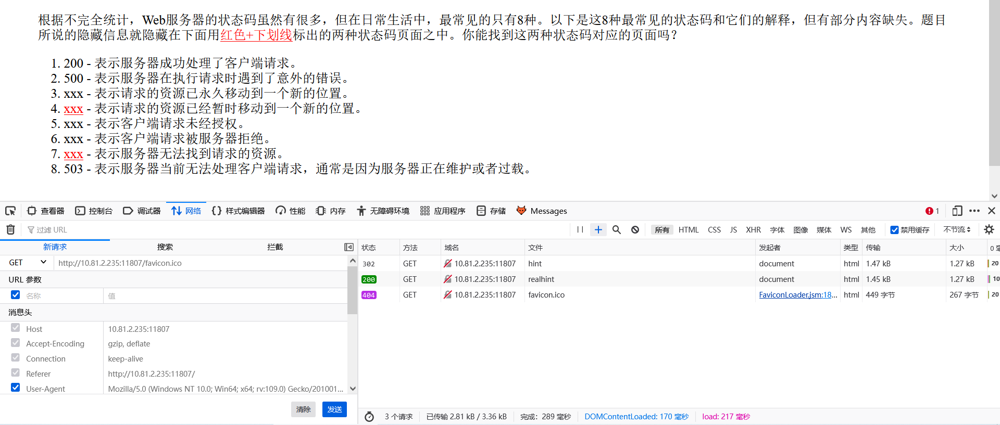
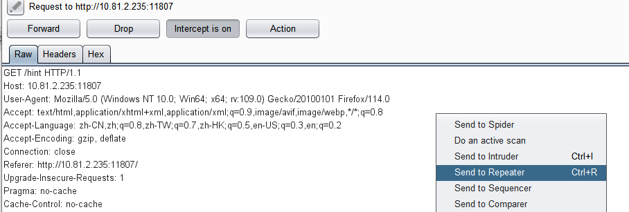
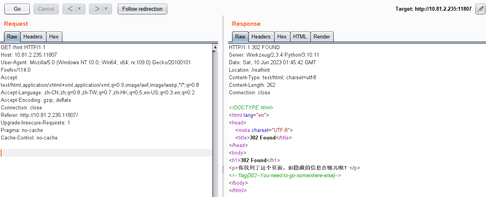
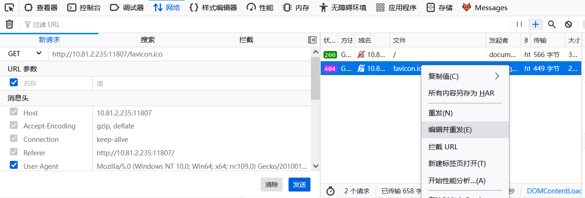
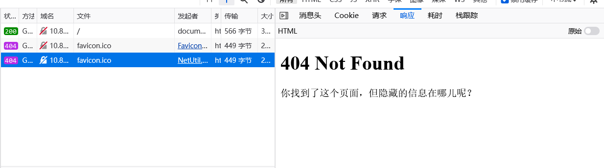
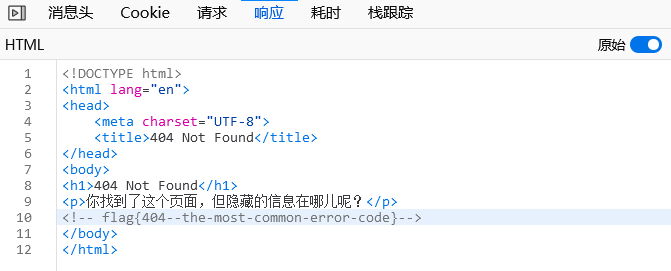

# Write Up

Recogerous 2023/6/10

## Http请求状态码考核

在 hint 中可以看到含有隐藏信息的两个缺少的状态码分别为 `302`、`404`。

1. 302

在环境中进入开发者模式，打开 [this is a hint](http://10.81.2.235:11807/hint) 链接，可以看到状态码为 `302` 的请求。可以看出，发生了重定向。

在 Burp Suite 中拦截打开链接时的请求，发送到 Repeater 中：

在 Repeater 中点击“Go”发送请求，得到 `/hint` 页面的响应。

找到flag：`flag{302--You-need-to-go-somewhere-else}`

 

2. 404

在环境中进入开发者模式，刷新页面即可查看到 `404` 状态码对应的请求，右键该请求，选择“编辑并重发”，在左侧的“新请求”中点击“发送”。

在右侧的“响应”中可以看到 `404` 对应的页面。

打开“原始”开关阅读源代码，找到 flag：`flag{404--the-most-common-error-code}`

