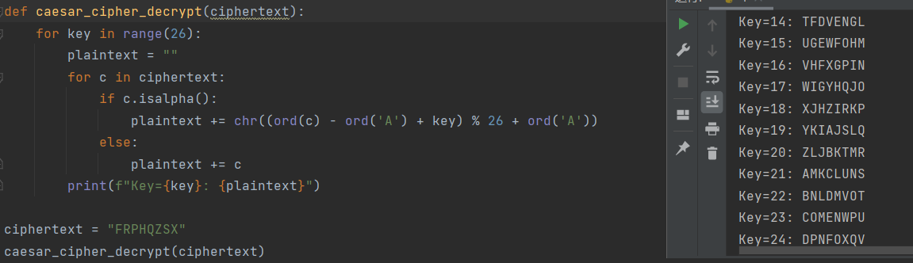
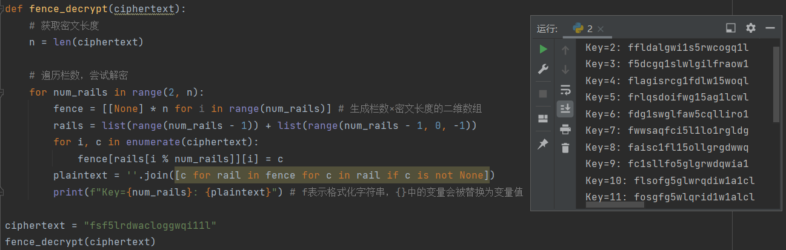
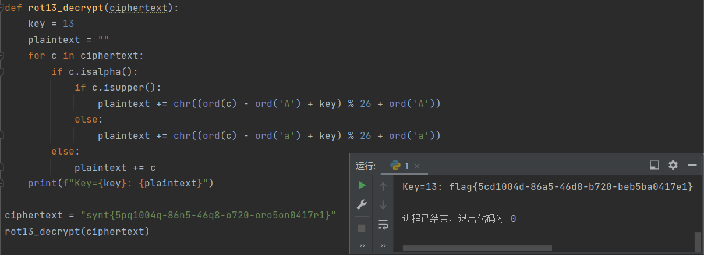
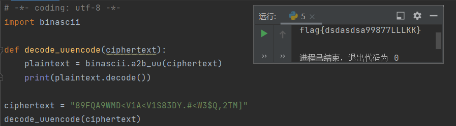
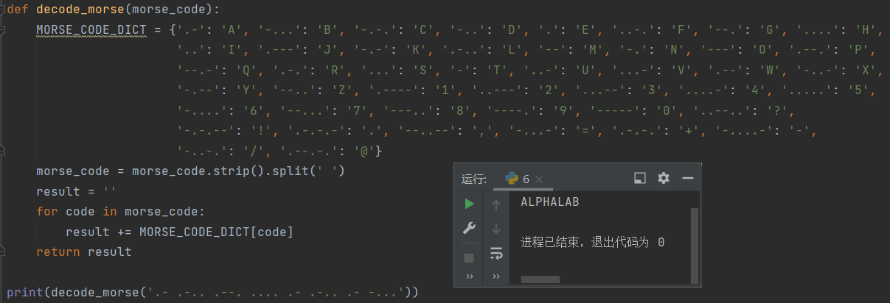
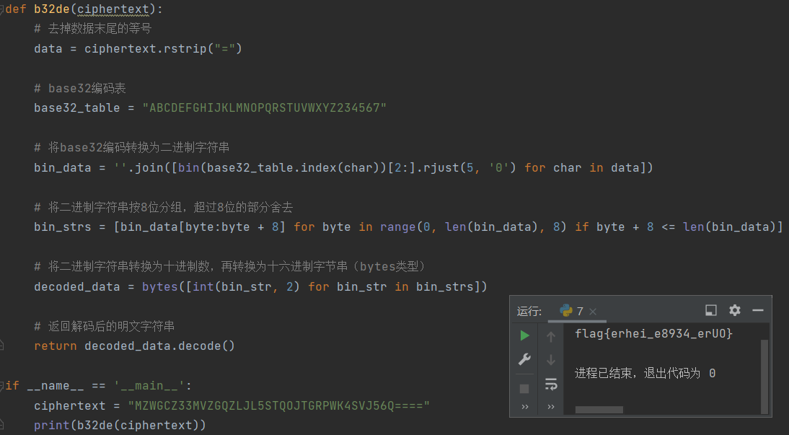

- [密码学解密网站汇总 - 爱码网](https://www.likecs.com/show-480434.html)
- [在线摩斯电码加密解密 - 码工具](https://www.matools.com/morse)
- [CTF在线工具-CTF工具|CTF编码|CTF密码学|CTF加解密|程序员工具|在线编解码](http://www.hiencode.com/)
- [加密解密 - 加密解密工具 第3页 - 一个工具箱 - 好用的在线工具都在这里！](http://www.atoolbox.net/Category.php?Id=27&Page=3)
- [加密解密](http://encrypt.fitfrom.com/)

# 题目一

## 解题思路

“大帝”即凯撒大帝。使用密钥空间 $\{1,\,2,\,\cdots,\,25\}$ 依次进行解密，得到唯一有意义的字符串。默认偏移量为 3，因为这是凯撒大帝本人使用的密钥。

python 实现：

```python
def caesar_cipher_decrypt(ciphertext):
    for key in range(26):
        plaintext = ""
        for c in ciphertext:
            if c.isalpha():
                plaintext += chr((ord(c) - ord('A') + key) % 26 + ord('A'))
            else:
                plaintext += c
        print(f"Key={key}: {plaintext}")

ciphertext = "FRPHQZSX"
caesar_cipher_decrypt(ciphertext)
```

## 运行结果

使用工具实现：


python 实现：



当密钥为默认的 3 时，可破解出唯一有意义的字符串，即明文是 `COMENWPU`。

# 题目二

## 解题思路

木册木兰即为栅栏密码，密文为 `fsf5lrdwacloggwqi11l`，共 20 个字符，对应因数为 2、4、5、10，在工具中分别予以尝试分栏，得出结果。

python 实现（栏数穷举）：

```python
def fence_decrypt(ciphertext):
    # 获取密文长度
    n = len(ciphertext)

    # 遍历栏数，尝试解密
    for num_rails in range(2, n):
        fence = [[None] * n for i in range(num_rails)] # 生成栏数×密文长度的二维数组
        rails = list(range(num_rails - 1)) + list(range(num_rails - 1, 0, -1))
        for i, c in enumerate(ciphertext):
            fence[rails[i % num_rails]][i] = c
        plaintext = ''.join([c for rail in fence for c in rail if c is not None])
        print(f"Key={num_rails}: {plaintext}") # f表示格式化字符串，{}中的变量会被替换为变量值

ciphertext = "fsf5lrdwacloggwqi11l"
fence_decrypt(ciphertext)
```

## 运行结果




唯一有意义的字符串，即明文是 `flagisrcg1fdlw15woql`。

# 题目三

## 解题思路


按图索骥即可。

## 运行结果

明文为 `THE QUICK BROWN FOX JUMPS OVER THE LAZY DOG`。

> 该句据说是包含所有26个字母的最短的句子。现在各类浏览器的字体设定中常把该句子作为预览句。读出前三个单词之后便可以发现这句话的特殊地位，并猜出后面的内容。

# 题目四

## 解题思路

从“回旋踢，一共踢了 13 脚”可以推断是 ROT13（回转13位）加密方式。ROT13 的原理是将每个字母用其在英文字母表中 13 位之后的字母替代后得到密文，因此对密文套用同样的算法，再执行一次 ROT13 就可以得到明文，称为对等加密，数学上称为对合。

使用工具“再踢 13 脚”即可。

本质上是凯撒密码的密钥为 13 时的情况，因此 python 实现方式可以参考第一题的代码：

```python
def rot13_decrypt(ciphertext):
    key = 13
    plaintext = ""
    for c in ciphertext:
        if c.isalpha():
            if c.isupper():
                plaintext += chr((ord(c) - ord('A') + key) % 26 + ord('A'))
            else:
                plaintext += chr((ord(c) - ord('a') + key) % 26 + ord('a'))
        else:
            plaintext += c
    print(f"Key={key}: {plaintext}")
```

## 运行结果




明文为 `flag{5cd1004d-86a5-46d8-b720-beb5ba0417e1}`

# 题目五

## 解题思路

uuencode 的原理是：

1. 将输入的明文以 3 字节为单位编码，不足 3 字节则补零。
2. 每 3 字节共有 24bit，以 6bit 为单位分为 4 组，每组的 6 位二进制数以十进制来表示，其值在 0~63‌ 之间。
3. 将每个上述得到的十进制数加上 32，用得到的数对应 ASCII 字符集中的可打印字符，来作为输出的密文。 
4. 每输出 60 个密文将作为独立的一行，每行的开头会加上一个字符，用来表示该行代表的输入字符的个数，该字符的 ASCII 码为 32 + 该行的字节数目（除最后一行外，该字符都为 32+45=77，即 `M`）。

使用在线网站 [CTF 在线工具-在线 UUencode 编码|UU 编码|UUencode 解码|UUencode 编码原理|UUencode 编码算法](http://www.hiencode.com/uu.html) 解码即可。

python 中可使用 `a2b_uu()` 函数来解密：

```python
import binascii

def decode_uuencode(ciphertext):
    plaintext = binascii.a2b_uu(ciphertext)
    print(plaintext.decode())

ciphertext = "89FQA9WMD<V1A<V1S83DY.#<W3$Q,2TM]"
decode_uuencode(ciphertext)
```

## 运行结果




明文为`flag{dsdasdsa99877LLLKK}`

# 题目六

## 解题思路

由题目描述和图片可知是莫斯编码。将图片内容转换为莫斯编码：`.- .-.. .--. .... .- .-.. .- -...`，使用工具解密即可。

解码的 python 实现： 

```python
def decode_morse(morse_code):
    MORSE_CODE_DICT = {'.-': 'A', '-...': 'B', '-.-.': 'C', '-..': 'D', '.': 'E', '..-.': 'F', '--.': 'G', '....': 'H', '..': 'I', '.---': 'J', '-.-': 'K', '.-..': 'L', '--': 'M', '-.': 'N', '---': 'O', '.--.': 'P', '--.-': 'Q', '.-.': 'R', '...': 'S', '-': 'T', '..-': 'U', '...-': 'V', '.--': 'W', '-..-': 'X', '-.--': 'Y', '--..': 'Z', '.----': '1', '..---': '2', '...--': '3', '....-': '4', '.....': '5', '-....': '6', '--...': '7', '---..': '8', '----.': '9', '-----': '0', '..--..': '?', '-.-.--': '!', '.-.-.-': '.', '--..--': ',', '-...-': '=', '.-.-.': '+', '-....-': '-', '-..-.': '/', '.--.-.': '@'}
    morse_code = morse_code.strip().split(' ')
    result = ''
    for code in morse_code:
        result += MORSE_CODE_DICT[code]
    return result

print(decode_morse('.- .-.. .--. .... .- .-.. .- -...'))
```

## 运行结果




明文为 `ALPHALAB`

# 题目七

## 解题思路

Base 编码原理为：

- base64：将每 3 个字节的二进制数据转换为 4 个可打印字符，即将 3 个 8 位二进制数转换为 4 个 6 位数，在该 6 位数的高位补 2 个 0 形成新的字节。如果原始数据分割之后不足 6 位，则补 0；如果转换后的密文的字节数（即字符串长度）不是 4 的倍数，则补 `=` 字符。（即原始数据补 0 至 24 位的倍数）
- base32：将每 5 个字节的二进制数据转换为 8 个可打印字符，即将 5 个 8 位二进制数转换为 8 个 5 位数，在该 5 位数的高位补 3 个 0  形成新的字节。如果原始数据分割之后不足 5 位，则补 0；如果转换后的密文的字节数（即字符串长度）不是 8 的倍数，则补 `=` 字符。（即原始数据补 0 至 40 位的倍数）
- base16：将每个字节的二进制数据转换为 2 个可打印字符，即将每个 8 位二进制数转换为 2 个 4 位数，每个 4 位数被转换为一个十六进制数字。无需补 0。

我们可以通过以下方法来辨别某字符串是 Base64、Base32 还是 Base16 编码：

1.  Base64 编码的文本字符串的长度是 4 的倍数，并且只包含大小写字母、数字和“+”、“/”。
2.  Base32 编码的文本字符串的长度是 8 的倍数，并且只包含大写字母和数字 2~7。
3.  Base16 编码的文本字符串的长度是 2 的倍数，并且只包含数字 0~9 和 A~F。

因此，本题中的字符串最有可能是 Base32。

base32 解码的 python 实现如下：

```python
# -*- coding: utf-8 -*-
def b32de(ciphertext):
    # 去掉数据末尾的等号
    data = ciphertext.rstrip("=")

    # base32编码表
    base32_table = "ABCDEFGHIJKLMNOPQRSTUVWXYZ234567"

    # 将base32编码转换为二进制字符串
    bin_data = ''.join([bin(base32_table.index(char))[2:].rjust(5, '0') for char in data])

    # 将二进制字符串按8位分组，超过8位的部分舍去
    bin_strs = [bin_data[byte:byte + 8] for byte in range(0, len(bin_data), 8) if byte + 8 <= len(bin_data)]

    # 将二进制字符串转换为十进制数，再转换为十六进制字节串（bytes类型）
    decoded_data = bytes([int(bin_str, 2) for bin_str in bin_strs])

    # 返回解码后的明文字符串
    return decoded_data.decode()

if __name__ == '__main__':
    ciphertext = "MZWGCZ33MVZGQZLJL5STQOJTGRPWK4SVJ56Q===="
    print(b32de(ciphertext))
```

## 运行结果




明文：`flag{erhei_e8934_erUO}`

# 题目八

## 解题思路

由字符串分割方式可以判断是键盘密码（不是望文生义的敲击码）。键盘码有两种形式，一种是敲击键盘对应字符所形成的轨迹形似明文字符，另一种是键盘上对应的字符将明文字符圈起来。后者很可能因为明文字符在键盘最上面或最右面，而导致密文中出现非英文字母的字符，因此可以判断本题中的键盘密码是第一种。

敲击键盘对应字符并观察轨迹即可。

## 运行结果


明文：`XVZOC`
