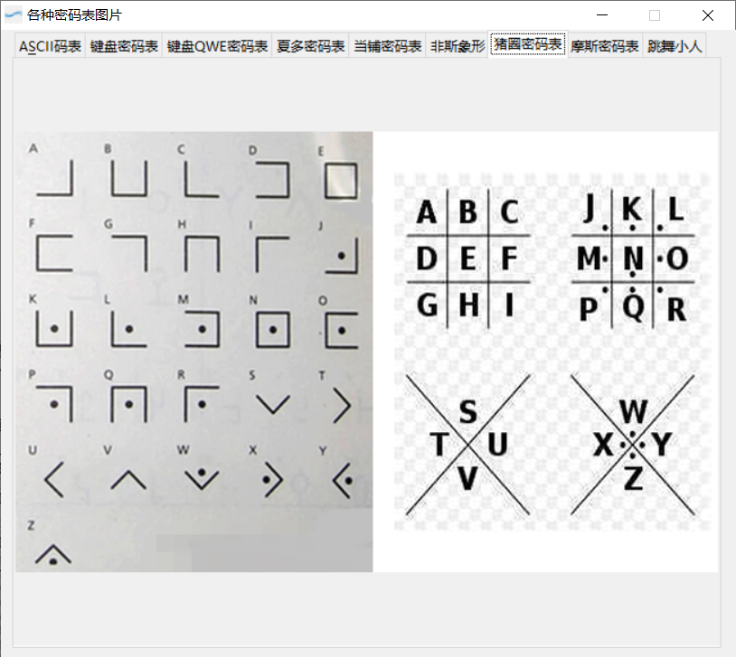

- [密码学解密网站汇总 - 爱码网](https://www.likecs.com/show-480434.html)
- [在线摩斯电码加密解密 - 码工具](https://www.matools.com/morse)
- [CTF在线工具-CTF工具|CTF编码|CTF密码学|CTF加解密|程序员工具|在线编解码](http://www.hiencode.com/)
- [加密解密 - 加密解密工具 第3页 - 一个工具箱 - 好用的在线工具都在这里！](http://www.atoolbox.net/Category.php?Id=27&Page=3)
- [加密解密](http://encrypt.fitfrom.com/)

# 题目一

## 解题思路

“大帝”即凯撒大帝。使用密钥空间 $\{1,\,2,\,\cdots,\,25\}$ 依次进行解密，得到唯一有意义的字符串。

## 运行结果

唯一有意义的字符串，即明文是 `COMENWPU`。

# 题目二

## 解题思路

木册木兰即为栅栏密码，密文为 `fsf5lrdwacloggwqi11l`，共 20 个字符，对应因数为 2、4、5、10，在工具中分别予以尝试分栏，得出结果。

## 运行结果

唯一有意义的字符串，即明文是 `flagisrcg1fdlw15woql`。

# 题目三

## 解题思路

按图索骥即可。

## 运行结果

明文为 `THE QUICK BROWN FOX JUMPS OVER THE LAZY DOG`。

> 该句据说是包含所有26个字母的最短的句子。现在各类浏览器的字体设定中常把该句子作为预览句。读出前三个单词之后便可以发现这句话的特殊地位，并猜出后面的内容。

# 题目四

## 解题思路

从“回旋踢，一共踢了 13 脚”可以推断是 ROT13（回转13位）加密方式。ROT13 的原理是将每个字母用其在英文字母表中 13 位之后的字母替代后得到密文，因此对密文套用同样的算法，再执行一次 ROT13 就可以得到明文，称为对等加密，数学上称为对合。

使用工具“再踢 13 脚”即可。

## 运行结果

明文为 `flag{5cd1004d-86a5-46d8-b720-beb5ba0417e1}`

# 题目五

## 解题思路

uuencode 的原理是：

1. 将输入的明文以 3 字节为单位编码，不足 3 字节则补零。
2. 每 3 字节共有 24bit，以 6bit 为单位分为 4 组，每组的 6 位二进制数以十进制来表示，其值在 0~63‌ 之间。
3. 将每个上述得到的十进制数加上 32，用得到的数对应 ASCII 字符集中的可打印字符，来作为输出的密文。 
4. 每输出 60 个密文将作为独立的一行，每行的开头会加上一个字符，用来表示该行代表的输入字符的个数，该字符的 ASCII 码为 32 + 该行的字节数目（除最后一行外，该字符都为 32+45=77，即 `M`）。

使用在线网站 [CTF 在线工具-在线 UUencode 编码|UU 编码|UUencode 解码|UUencode 编码原理|UUencode 编码算法](http://www.hiencode.com/uu.html) 解码即可。

## 运行结果

明文为`flag{dsdasdsa99877LLLKK}`

# 题目六

## 解题思路

由题目描述和图片可知是莫斯编码。将图片内容转换为莫斯编码：`.- .-.. .--. .... .- .-.. .- -...`，使用工具解密即可。

## 运行结果

明文为 `ALPHALAB`

# 题目七

## 解题思路

Base 编码原理为：

- base 64：每 3 个 8 bit 字节转换为 4 个 6 bit 的字节，不足 24 位后面补 0。6 bit 高位补两个零，使用该数值对应的 ASCII 字符作为密文输出。
- base 32：每 5 个 8 bit 转换为 8 个 5 bit，不满 40 bit 则补 0，5 bit 的 0 相当于 `=`；
- base 16：每 4 个 8 bit 转换为 8 个 4 bit，不满 32 bit 则补 0，4 bit 的 0 相当于 `=`；`

使用工具解密即可。

## 运行结果

明文：`flag{erhei_e8934_erUO}`

# 题目八

## 解题思路

由字符串分割方式可以判断是键盘密码（不是望文生义的敲击码）。键盘码有两种形式，一种是敲击键盘对应字符所形成的轨迹形似明文字符，另一种是键盘上对应的字符将明文字符圈起来。后者很可能因为明文字符在键盘最上面或最右面，而导致密文中出现非英文字母的字符，因此可以判断本题中的键盘密码是第一种。

敲击键盘对应字符并观察轨迹即可。

## 运行结果

明文：`XVZOC`
