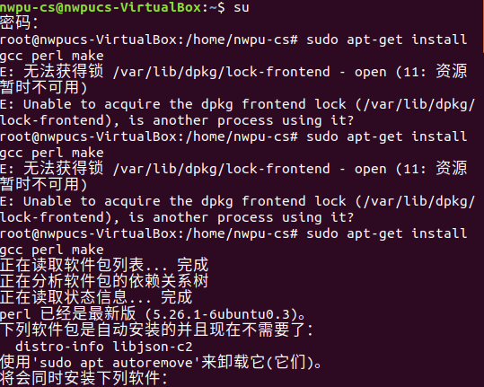
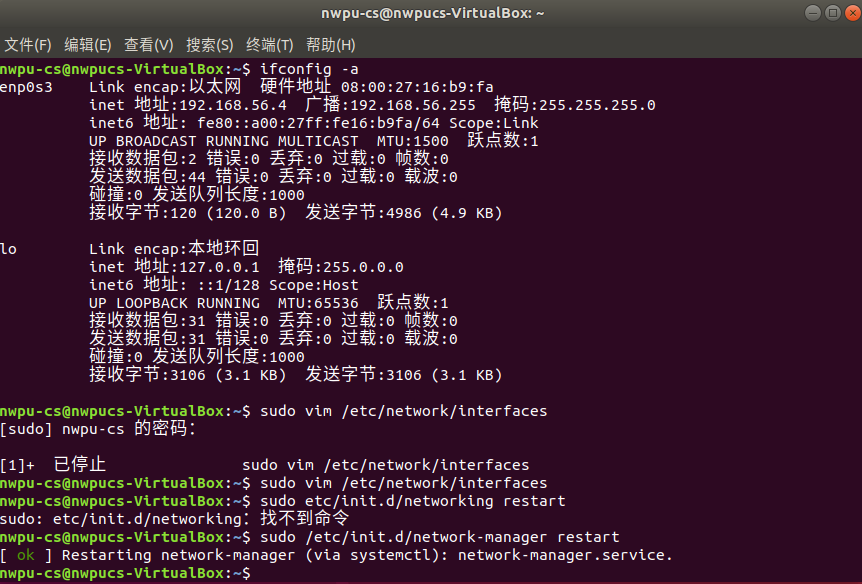
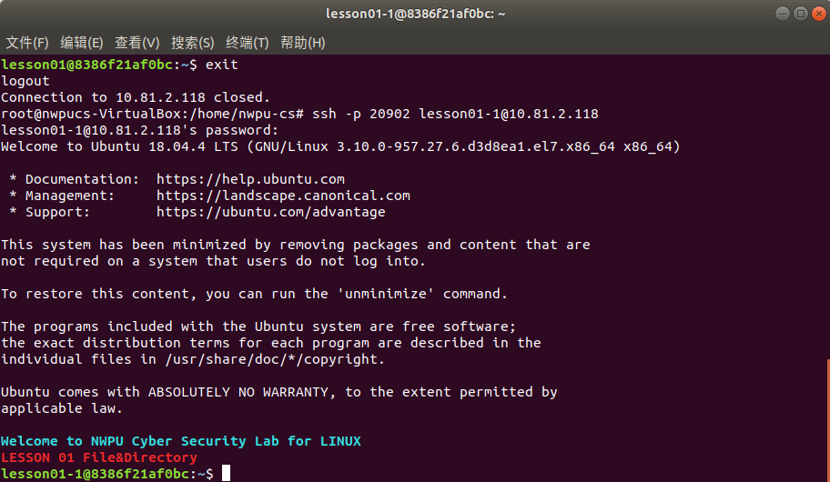
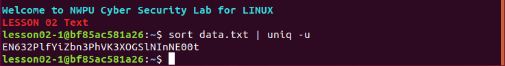

# 里-Linux-实验 1-7 实验报告

[TOC]

## 实验一

### 实验目的

1. 熟悉 VirtualBox 等虚拟机用法，并配置 Ubuntu Linux 实验环境
2. 了解和使用 Linux 常用 shell 工具，并掌握通用的帮助或手册用法
3. 能够使用基础命令查看主机名、网络配置
4. 能够查看 CPU、内存配置与使用状态以及系统内核版本与发行版本
5. 能够完成与宿主机的网络配置，理解不同网络配置类型的区别
6. 能够对常用软件镜像源进行修改
7. 能够在 Linux 环境中配置 SSH 服务
8. 熟练使用命令行或 GUI 工具通过 SSH 远程连接 Linux

### 实验过程

#### 安装 Ubuntu Linux 

从官网安装 VirtualBox，从镜像网站下载 Ubuntu 系统，安装虚拟机。

“设置”-“网络”-“连接方式”中改为“桥接网卡”，打开“共享粘贴板”的双向共享。输入 `sudo passwd root` 修改 root 密码。更换 apt 源，输入 `sudo apt-get install gcc perl make`。



加载 VBoxGuestAdditions.iso，在“设备”中安装增强功能，打开 VBox_GAs_6.1.16，运行软件后输入密码进行安装，安装完毕输入 `reboot` 重启，打开“无缝模式”。


在“设置”-“共享文件夹”中添加共享文件夹。终端中输入 `sudo usermod -a -G vboxsf nwpu-cs`。安装 vim（`sudo apt-get install vim`），打开 `/etc/sudoers`，添加 `<yourusername> ALL=NOPASSWD: ALL`，按 <kbd>Esc</kbd>，输入 `:wq!` 强制保存。重启后，完成共享文件夹的设置。


$p.s.\quad$ vim 安装失败，未满足依赖（依赖: vim-common (= 2:7.4.1689-3ubuntu1.5) 但是......），输入如下命令：

```bash
sudo apt-get purge vim-common  
sudo apt-get update  
sudo apt-get upgrade
```

#### 熟悉 Ubuntu Linux 命令

打开终端，输入 `ls`、`ls -a`、`ls -l`、`ls -t`、`ls -R` 查看文件，得到如下结果：


使用“Tab”、“↑”、“↓”来补全命令，成功。

查看 bash 历史记录，输入 `history` 命令，结果如下：


可以看到，这里记录了本用户之前运行过的命令。这些命令被记录在.bash_history 文件中，也可以通过 `cat` 命令查看。

---

使用 `man` 命令查看 `ls` 手册，输入 `man ls` 命令，见下图左；执行 `ls --help` 查看帮助，见下图右：


可以发现，两者同样显示命令的语法，对命令选项的描述也相同。但 `man` 命令的文档中信息更多，包含作者、错误提交、版权信息等信息。

输入 `man pwd` 命令，文档在 NAME 栏显示 “print name of current/working directory”, 在 DISCRIPTION 中显示 “Print the full filename of the current working directory.”可以看出 `pwd` 命令的功能是查看当前工作目录的完整路径。

---

使用 `date`、`hostname`、`top`、`uname` 命令来查看系统时间、主机名、实时系统占用情况和内核版本，结果如下：


通过 `cat` 命令查看当前系统中 CPU 信息、内存信息，分别输入 `cat /proc/cpuinfo`、`cat /proc/meminfo` 命令，如下：


#### 网络配置

##### NAT 网络

打开管理->全局设定->网络，点击“添加新 NAT 网络。”再选中添加的网络，点“编辑 NAT 网络。”将“网络 CIDR”改为 192.168.56.0/24。


打开虚拟机的“设置”，打开“网络”，在“连接方式”中选择 “NAT 网络”。打开“高级”，在“混杂模式”中选择“全部允许”。


在终端中输入 `ifconfig` 命令，查看使用“NAT 网络”的网卡名称为“enp0s3”。



输入 `sudo vim /etc/network/interfaces` 命令打开 vim 编辑器修改配置文件，在配置文件中添加如下内容（重新装了个虚拟机又试了一次，inet 地址有变动）：


敲 <kbd>Esc</kbd>，输入 `:wq` 保存并退出。重启虚拟机，终端中输入 `sudo /etc/init.d/network-manager restart`，重启网卡。因未知原因无法成功。

##### 桥接网卡


如上图设置。虚拟机可成功联网。


在宿主机中使用 ping 命令来测试与虚拟机的连通性：


##### Host-only

打开管理->全局设定->网络，点击“添加新 NAT 网络。”再选中添加的网络，点“编辑 NAT 网络。”将“网络 CIDR”改为 192.168.56.0/24。


打开虚拟机的“设置”，打开“网络”，在“连接方式”中选择 “仅主机（Host-Only）网络”。打开“高级”，在“混杂模式”中选择“全部允许”。


在终端中输入 `ifconfig` 命令，查看使用 Host-Only 的网卡名称为“enp0s8”。


输入 `sudo vim /etc/network/interfaces` 命令打开 vim 编辑器修改配置文件，在配置文件中添加如下内容，并保存、重启：


在宿主机中 ping 虚拟机成功，但是虚拟机中不能联网：


#### apt 换源

在终端中输入 `sudo cp /etc/apt/sources.list sources_backup.list` 进行备份。输入 `sudo gedit /etc/apt/sources.list` 修改 sources.list 文件，添加阿里云源：


保存后在终端中输入如下命令，完成换源：

```bash
sudo apt-get update
sudo apt-get -f install
sudo apt-get upgrade
```


#### ssh 服务端安装与配置

输入 `openssl version`，输出 `OpenSSL 1.1.0g  2 Nov 2017`，发现已安装。

安装以下内容：

```bash
sudo apt-get install libssl-dev
sudo apt-get install openssh-client
sudo apt-get install openssh-server
```


使用 `dpkg -l |grep ssh` 可查看是否安装成功。使用 `sudo service ssh start` 启动 ssh-server。使用 `sudo ps -e|grep ssh` 查看是否启动，若有 sshd 则说明 ssh-server 已经启动。


使用 `whereis sshd` 可找到 ssh-server 所在目录。

使用 `sudo vim /etc/ssh/ssh_config` 进行 SSH 服务端配置。配置完成后使用 `sudo service ssh restart` 重启。


#### 宿主机远程连接

安装网络工具：`sudo apt install net-tools`

关闭主机和虚拟机防火墙：Ubuntu 中输入 `sudo ufw disable`，Window 中在 windows 安全中心关闭防火墙。

在虚拟机中使用 `ifconfig` 或 `ip addr` 命令查找到 ip 信息：192.168.1.100

安装 MobaXterm，在“Session”-“SSH”-“Basic SSH settings”中输入 Ubuntu 系统的 ip 地址、用户名和端口号并连接。输入密码后，连接成功。


### 参考资料

- [Kali Linux 2022.3 vmware-amd64](https://b.wuyuru.cn/303.html)
- [3 实操部分_哔哩哔哩_bilibili](https://www.bilibili.com/video/BV1jE411c785/?p=3&vd_source=5053a1054efc12e95eb76c066ad13f8f)
- [实验 1 VirtualBox 中安装 Ubuntu16.04 - 知乎](https://zhuanlan.zhihu.com/p/362863381)
- [Ubuntu 在命令行下不能够切换字母的大小写，只能输入大写字母_点亮～黑夜的博客-CSDN 博客](https://shliang.blog.csdn.net/article/details/108216983)
- [Linux 进入 root 权限的两种方法_linux root_普通网友的博客-CSDN 博客](https://blog.csdn.net/m0_67402026/article/details/126434739)
- [TLinux: 执行 sudo apt install gcc 提示“软件包 gcc 没有可安装候选”_weixin_46523365 的博客-CSDN 博客](https://blog.csdn.net/weixin_46523365/article/details/105637612)
- [Ubuntu16.04 更换 apt 阿里源-CSDN 博客](https://blog.csdn.net/bitcsljl/article/details/127105445)
- [ubuntu 16.04 更换国内源_ubuntu16 换源_是你的杰克的博客-CSDN 博客](https://blog.csdn.net/qq_40301372/article/details/108622277)
- [Ubuntu 更换国内源（apt 更换源）_docker ubuntu 换国内源_鬼才血脉的博客-CSDN 博客](https://blog.csdn.net/qq_34915141/article/details/127528582)
- [修改 linux 域名解析失败,Ubuntu16.04 更新源失败暂时不能解析域名＂us.archive.ubuntu.com..._kokosK 的博客-CSDN 博客](https://blog.csdn.net/weixin_34479122/article/details/116892194)
- [其他笔记 - virtualbox 共享文件夹无访问权限等问题_vboxclient: failed to get display change request, _canmoumou 的博客-CSDN 博客](https://blog.csdn.net/u013013023/article/details/109159133)
- [解决 Ubuntu 与 Virtualbox 虚拟机共享文件夹无权限的问题（保姆级）_ubuntu 共享文件夹没有权限访问_孤叶飘飘的博客-CSDN 博客](https://blog.csdn.net/m0_63779958/article/details/126997883)
- [linux 系统没有可用的软件包 gcc, 现在没有可用的软件包 vim, 被其它软件包引用了,gcc 命令无法使用..._weixin_39717029 的博客-CSDN 博客](https://blog.csdn.net/weixin_39717029/article/details/116748610)
- [Ubuntu Vim 安装失败未满足依赖_uupweng 的博客-CSDN 博客](https://blog.csdn.net/Oil__/article/details/113384278)
- [ubuntu16.04 使用问题笔记 - 佛法无边 - 博客园](https://www.cnblogs.com/fofawubian/p/8031671.html)
- [vim /etc/sudoers 修改只读文件_计算机视觉小白之旅的博客-CSDN 博客](https://blog.csdn.net/qq_34246778/article/details/102694993)
- [Linux 系统 vim 编辑器使用方法：编辑、保存和退出_linux 保存退出 vim_夏茗 xm 的博客-CSDN 博客](https://blog.csdn.net/qq_52671517/article/details/124673951)
- [security - How do I disable Ubuntu Authenticate popup that is used to elevate privileges? - Super User](https://superuser.com/questions/243662/how-do-i-disable-ubuntu-authenticate-popup-that-is-used-to-elevate-privileges)
- [password - Authentication for everything - Ask Ubuntu](https://askubuntu.com/questions/86040/authentication-for-everything)
- [ubuntu20.04 重启网络方法_ubuntu 重启网络_一只小菜鸟 ya 的博客-CSDN 博客](https://blog.csdn.net/workMATLABhard/article/details/123679197)
- [openssl 安装与使用_apt install openssl_puppycuty 的博客-CSDN 博客](https://blog.csdn.net/qq_38125626/article/details/120569339)
- [ubuntu20.04 安装 openssh-server 报依赖错误的解决方法_apt-get install openssh-server_萝卜丝 18 的博客-CSDN 博客](https://blog.csdn.net/qq_42310235/article/details/118084540)
- [ssh 安装与配置（详解版）_余识-的博客-CSDN 博客](https://blog.csdn.net/weixin_50964512/article/details/123588745)
- [ubuntu18.04 openssh 客户端和服务端 安装及配置 - 灰信网（软件开发博客聚合）](https://www.freesion.com/article/2074388571/)
- [SSH 服务配置_ssh 配置_Liq1 的博客-CSDN 博客](https://blog.csdn.net/Liqi23/article/details/127466997)
- [MobaXterm远程登录Ubuntu（详细教程）_mobaxterm ubuntu_孤生i的博客-CSDN博客](https://blog.csdn.net/qq_59134387/article/details/126854569)


## 实验二

### 实验目的

1. 学习使用常用命令：ls，cd，cat，find，file
2. 理解基本的用户与文件权限

### 实验过程

#### lesson01-0

根据实验环境输入命令 `ssh -p  20004 lesson01@10.81.2.118`，远程连接给定目标。


输入 `ls` 查看文件，输入 `cat readme` 查看“readme”的内容：ieEWq6ht


#### lesson01-1

输入 `exit` 退出，使用原端口号（中途实验延时一次）和 IP 地址，用 lesson01-1 登录，密码为上述的 ieEWq6ht。



查看文件输入命令：`cat ./-`，得到密码 gy5f6rs7


#### lesson01-2

连接方式同上。查看文件输入命令：`cat 'spaces in this filename'`，得到密码 iJpMOHR5


> 双引号（" "）：弱引用；除 $、''、 \`、\\ 以外所有的字符都解释成字符本身而成为普通字符。
> 
> 单引号（' '）：强引用；所有的字符包括特殊字符（ $、''、\`、\\ ）都解释成字符本身。
> 
> 反引号（\` \`）：命令替换；在反引号中的字符串将解释成 shell 命令来执行，且优先执行。

#### lesson01-3

输入 `ls -a` 命令查看所有文件和文件夹，发现隐藏文件.hidden，内容/密码为：S5O0FGZb


#### lesson01-4

查看主目录下 ASCII 格式的文本文件内容：使用 `file` 命令辨识文件类型，查找出 File (7) 为 ASCII 格式的文本文件内容，用 `cat` 命令查看，得到密码为 s3XECIPV


#### lesson01-5

用 `find` 命令找出 maybehere 文件夹，进入该文件夹。


查看该文件夹满足以下条件文件的内容：“文件大小为 1008 字节，文本文件，不可执行”：使用 `find . -size 504w -exec ls -l {} \;` 命令，查找 504 个字（2 字节）的文件，列出完整路径，找出该文件并查看，最后 8 字符为 gHm7YP4l


$p.s.\quad$ 完整且符合题意的命令应为 `find -size 1008c -type f ! -executable -exec ls -l {} \;`

#### lesson01-6

查找满足以下条件文件：“在`/var`路径下，属于用户 lesson01-6、属于用户组 lesson01-5、文件大小为 50 字节”，查看该文件内容：使用 `find /var -user lesson01-6 -group lesson01-5 -size 50c -exec ls -l {} \;` 命令，找出文件并查看，最后 8 字符为 x4jYq8w0


> What does {} \\; mean in the find command?
> 
> Save this answer. If you run find with exec , {} **expands to the filename of each file or directory found with find** (so that ls in your example gets every found filename as an argument - note that it calls ls or whatever other command you specify once for each file found). Semicolon ; ends the command executed by exec .
> 
> What is {} \\; at the end of find command?
> 
> find -exec uses {} to pass the current file name to the specified command, and \\; **to mark the end of the the command's arguments**. The \\ is needed because ; by itself is special to bash; by typing \\; , you can pass a literal ; character as an argument. (You can also type ';' or ";" .)

#### lesson01-7

使用 `./newcat2 /etc/lesson01_pass` 查看文件内容，显示 Congratulations! You have passed the lesson01RNclQnRG


查看文件，两者均为二进制文件。使用 `ls -l` 查看 newcat1、newcat2 ，发现两个文件权限不同。


对 newcat1、newcat2 使用 `md5sum ./newcat1 ./newcat2` 命令计算 md5 校验和，发现校验和相同，说明两者文件内容相同。


造成此差异的原因是 `md5sum` 只能比较文件内容而不能比较文件权限，而两个文件权限不同。

### 参考资料

**实验二到实验六均可以参考[Bandit](https://overthewire.org/wargames/bandit/)的内容。**

- [【bandit】WarGame之bandit通关日志 - 简书](https://www.jianshu.com/p/bf8cc6b0efd1)
- [OverTheWire-Bandit 1-27-网盾安全培训](https://www.chuanpuyun.com/article/968.html)
- [OverTheWire--bandit--level0~level33 - joker0xxx3 - 博客园](https://www.cnblogs.com/joker-vip/p/13195381.html)
- [OverTheWire-Bandit_overthewire bandit_目标是技术宅的博客-CSDN博客](https://blog.csdn.net/LJFYYJ/article/details/116992592)
- [Wargames学习笔记--Bandit_Zhaohg720的博客-CSDN博客](https://blog.csdn.net/weixin_42820274/article/details/122820821)

> 绝大部分命令和 Shell 都可以在 [Linux 教程](https://www.runoob.com/linux/linux-tutorial.html) 中找到。

## 实验三

### 实验目的

1. 巩固使用常用命令：ls，cd，cat，find，file
2. 学习使用常用命令：grep，sort，uniq，strings，diff

### 实验过程

#### lesson02-0

SSH 远程连接同上个实验。

查找文件 data.txt 中，单词“millionth”后到段落结尾的文本内容：
使用 `grep -n millionth data.txt` 查找到单词 millionth 所在段落内容为：
`millionth    TESKZC0XvTetK0ObTUeMb5STk5iWrBvP`


（出于笔记本电量原因先在 MobaXterm 中做了一遍）

$p.s.\quad$ 使用 `grep -A98567 -n millionth data.txt` 可查看从 millionth 之后所有行的内容，98567 是指原文件共有 98567 行，因此使用 -A 参数最多需要输出这么多行。

#### lesson02-1

查找文件 data.txt 中，仅出现一次的文本行：
使用 `sort data.txt | uniq -u` 命令，查找文件 data.txt 中仅出现一次的文本行，得到：
`EN632PlfYiZbn3PhVK3XOGSlNInNE00t`




#### lesson02-2

查找文件 data.txt 中，查找以几个“=”开头的 ASCII 字符串：

使用 `strings` 命令查看文件中的字符串，并用 `grep` 进行过滤，命令是 `strings ./data.txt | grep -n =`


显然，the password is G7w8LIi6J3kTb8A7j9LgrywtEUlyyp6s .

#### lesson02-3

查找文件 passwords.old 和 passwords.new：


比较 passwords.old 和 passwords.new 文件内容，获取已更改的行内容：

使用 `diff ./passwords.new ./passwords.old` 命令比较文件内容的不同之处，也可以添加 `-y --suppress-common-lines` 参数：


"<"表示后面文件比前面文件少了该行内容，而">"表示后面文件比前面文件多了该行内容。显然，更改前该行的原内容是 810zq8IK64u5A9Lb2ibdTGBtlcSZsoe8，而更改后该行的内容是 hga5tuuCLF6fFzUpnagiMN8ssu9LFrdg。

## 实验四

### 实验目的

1. 学习使用常用命令：crontab
2. 能够阅读理解简单的 Shell 脚本

### 实验过程

通过 SSH 远程连接给定目标：同前 2 个实验，`ssh -p 25724 lesson03@10.81.2.118`。

#### lesson03-1

在 /etc/cron.d 查找定时任务 cronjob_lesson03_1，思考该任务的执行周期是多长？分析该定时任务写入临时文件的内容：


```shell
@reboot lesson03-1 /usr/bin/lesson03_shell1.sh &> /dev/null
* * * * * lesson03-1 /usr/bin/lesson03_shell1.sh &> /dev/null
```

上面的定时任务出现了五个\*，说明该任务执行周期为：每分钟执行一次。

该脚本在后台运行，并丢弃所有标准输出和标准错误输出。

vim 打开脚本文件 /usr/bin/lesson03_shell1.sh 发现，它将 /etc/lesson03_pass/lesson03_1 的内容重定向到 /tmp/t7O6lds9S0RqQh9aMcz6ShpAoZKF7fgv 中。


> #!/bin/bash 是指此脚本使用 /bin/bash 来解释执行。其中，#! 是一个特殊的表示符，后面紧跟着解释此脚本的 shell 路径。
>
> 命令>文件名 为 输出重定向；命令>>文件名 为 输出追加重定向，前两者等同于 1>、1>>；符号 2>（或追加符号 2>>）表示对错误输出设备重定向；&>将标准输出和错误输出同时送到同一文件中。

使用 `cat` 命令查看 `/tmp/t7O6lds9S0RqQh9aMcz6ShpAoZKF7fgv`，其中存放着一串字符 `750246E8-F75F-93FF-FBD8-55276B5C80BD`

#### lesson03-2

在 /etc/cron.d 查找定时任务 cronjob_lesson03_2，分析该定时任务写入临时文件的内容：

使用 `cat` 查看 cronjob_lesson03_2，定时任务如下：


```
@reboot lesson03-1 /usr/bin/lesson03_shell2.sh &> /dev/null
* * * * * lesson03-1 /usr/bin/lesson03_shell2.sh  &> /dev/null
```

注意到该任务的用户同样是 lesson03-1。

vim 打开脚本文件 /usr/bin/lesson03_shell2.sh 发现：


```bash
#!/bin/bash
myname=$(whoami)
mytarget=$(echo I am user $myname | md5sum | cut -d ' ' -f 1)
echo "Copying passwordfile /etc/lesson03_pass/$myname to /tmp/$mytarget"
cat /etc/lesson03_pass/$myname > /tmp/$mytarget
```

第二行这里 `$( )` 与 反引号 一样都用来命令替换，将 `whoami` 命令（获取用户名）的结果，即用户名赋值给 `myname`。

第三行 `echo` 命令显示字符串 `I am user $myname`，通过管道对该字符串进行 md5 加密，然后用 `cut` 命令取以空格为分隔符的第一个字符串，赋值给 `mytarget`。

第四行显示字符串 `Copying passwordfile /etc/lesson03_pass/$myname to /tmp/$mytarget`。

第五行将 `/etc/lesson03_pass/$myname` 的内容写入 `/tmp/$mytarget` 当中。

---

使用 `sh` 直接执行上述脚本文件，发现没有查看 `/etc/lesson03_pass/lesson03` 的权限。

使用 `cat /etc/passwd` 查看所有用户，发现除 `lesson03` 外还有一个用户 `lesson03-1`。再结合上文提到了定时任务 cronjob_lesson03_2 的用户是 lesson03-1，可以推知，脚本中的 `$myname`，即 `$(whoami)` 应当是 lesson03-1。

尝试 `echo I am user lesson03-1 | md5sum | cut -d ' ' -f 1 ` 命令，得到一串字符串： `f0e75b0176966cb3f4afd42278d75367`，再使用 `cat /tmp/f0e75b0176966cb3f4afd42278d75367` 命令，结果如下，得到 `C0B813FC-04B7-A447-9358-5286DFCCE0AC`：


## 实验五

### 实验目的

1. 理解 cron 配置文件和 shell 脚本
2. 编写简单的 shell 脚本

### 实验过程

SSH 远程连接：同上

#### 分析已经存在的定时任务

在 /etc/cron.d 发现定时任务 cronjob_lesson04_1，查看该任务得到：


```bash
* * * * * lesson04-root /usr/bin/lesson04_1.sh &> /dev/null
```

发现该任务每分钟将 `/usr/bin/lesson04_1.sh` 执行一次，并丢弃所有标准输出和标准错误输出。查看该脚本，得到：


```shell
#!/bin/bash
cd /var/spool/lesson04-1
for i in * .*;
do
    if [ "$i" != "." -a "$i" != ".." ];
    then
        owner="$(stat --format "%U" ./$i)"
        if [ "${owner}" = "lesson04-1" ]; then
            timeout -s 9 30 ./$i
        fi
        rm -f ./$i
    fi
done
```

第一行指定 shell 脚本解释器的路径；

第二行进入 `/var/spool/lesson04-1` 目录；

之后，对上述目录下的所有文件：将文件名赋给 `i`，若文件名不为“`.`”且文件名不为“`..`”，则查看（stat：查看文件的 inode 内容）该文件所有者的用户名（参数 --format "%U"），赋值给 `owner` 。若该用户名是 `lesson04-1`，则执行 i 文件，在 30 秒后超时，发送 SIGKILL 信号终止进程。之后删除该文件。总而言之，该脚本的作用即执行该目录下脚本文件并删除。


<center>timeout -s 命令的实例</center>

#### 获取 /etc/lesson04_2_pass 内容

获取该内容需要我们自己去写一个脚本，然后放进 `/var/spool/lesson04-1` 目录中执行，这个脚本的作用是将 `/etc/lesson04_2_pass` 中的内容重定向到可读的位置。

实验过程中我们所编写的脚本的用户是 `lesson04-1`，根据上述对定时任务的分析（若该用户名是 `lesson04-1`，则执行 i 文件），发现我们编写的脚本可以在 `/var/spool/lesson04-1` 目录中被自动执行，满足要求。

该脚本需要在可写的目录下来编写，然后拷贝到 `/var/spool/lesson04-1` 目录中。`/var/spool/lesson04-1` 目录的权限是 drwxrwxrwx，因此拷贝操作可以成功执行。使用 `find / -type d -perm -222 -exec ls -adl {} \;` 命令可以找出主目录中满足用户、群组、其他人可写权限的目录（以及大于此权限的目录），搜索到如下目录：


我们选择 `/tmp` 目录作为我们编写脚本的位置。

在该目录下创建新目录： `mkdir /tmp/test`，进入该目录： `cd /tmp/test`，创建并编写脚本文件 test. sh： `cat > /tmp/test/test.sh`，脚本内容如下：

```bash
#!/bin/bash
cat /etc/lesson04_2_pass >> /tmp/test/test.sh
```
使用 `chmod` 命令为该文件和所在目录添加可执行权限，然后将该脚本拷贝到 `/var/spool/lesson04-1` 目录中，等待结果：


等待一会之后，输入 `vim /tmp/test/test.sh` 命令，可以看到文件中多了一行字符串，这行字符串即为 `/etc/lesson04_2_pass` 的内容：`k6t69HILKC`


$p.s.\quad$ `^M` 是 vim 显示 0xD（\\r） 的方式，即回车符。使用 `cat` 查看就不会出现该字符。

$p.s.\quad$ 这里不应该使用 test 作为目录名和程序名。不过既然已经成功运行过了，此处就暂且不重新再做了。

> 在实际工作中，大多数脚本程序都会大量使用“[ ]”或“test”命令——即 shell 的布尔判断命令。...... 因为 test 命令在 shell 脚本程序以外用得并不是很频繁，所以许多很少编写 shell 脚本程序的 UNIX 用户往往会自己编写一个简单的程序并把它叫做 test。如果一个这样的程序不能够工作，十有八九是因为它与 shell 中的 test 命令发生了冲突。要想查看你自己的系统是否有一个与此同名的外部命令，可以试试“which test”这祥的命令，检查结果一般会是 /bintest 或 /usr/bin/test。——《Linux 程序设计（原书第 2 版）》

## 实验六

### 实验目的

1. 编写简单的 shell 脚本
2. 理解 linux 中管道的使用

### 实验过程

SSH 远程连接给定目标同上，密码为 `k6t69HILKC`。

#### 要求与思路

题目：主目录有一个程序，他需要一个正确的口令来告诉你下一关的密码。提示：口令格式为 lesson04-2xxxx，其中 xxxx 为纯数字。

使用 `ls -l` 发现主目录中的 `crackme`，执行该文件发现，该文件最多只能执行五次，而执行之后可尝试输入口令的次数没有限制。


由上述条件可知，我们需要写脚本来遍历所有可能的口令，并输入到 crackme 文件中去执行。这一过程是暴力破解的过程。同时，必须保证 crackme 文件只被执行一次。

可能的思路有：
1. 编写脚本，该脚本执行过程为：使用 for 循环生成口令的同时，通过管道输出到 crackme 文件中去执行，将执行结果重定向到另一个文件中（rst）；
2. 编写脚本，在该脚本中使用 for 循环生成口令，执行该脚本，并将输出通过管道传递给 crackme 文件，将执行结果重定向到另一个文件中；
3. 编写脚本，该脚本执行时生成所有可能的口令并存储到另一个文件中。将该口令文件逐行输出，并使用管道传递给 crackme 文件中去执行，将执行结果重定向到另一个文件中。

#### 思路1实现与结果

上文的思路 1：使用 `cat > a.sh` 创建一个脚本文件，并写入如下脚本：

```shell
#!/bin/bash
for i in `seq -f %04g 0 9999`
do
	echo "lesson04-2"$i | ./crackme > rst
done
```

`seq -f %04g 0 9999` 表示输出一段从 0 到 9999 的指定格式的序列，格式为 4 位输出，不足四位则在高位补 0。对于这个序列中的每一条数字，在前面补上 `"lesson04-2"` 之后，作为口令用 `echo` 命令输出，通过管道传递到 crackme 中执行，将执行结果传递到 rst 中。


上图为执行脚本后的结果。尽管在 `echo "lesson04-2"$i | ./crackme > rst` 这一行的命令中有 问题（为避免覆盖掉得到的密码，应该用追加的输出重定向 `>>` 而非输出重定向 `>`），我们仍可以通过思路本身和结果看出，这个脚本文件错误地将 crackme 执行了五次以上，从而导致文件无法再被执行，这一思路是错误的。

#### 思路2实现与结果

思路 2：使用 `cat > a.sh` 创建一个脚本文件，并写入如下脚本：

```Shell
#!/bin/bash
for i in `seq -f %04g 0 9999`
do
	echo "lesson04-2"$i
done
```


给脚本赋予权限（`chmod 777 a.sh`），执行该脚本（`./a.sh`）后，将输出结果（即口令）用管道传给 crackme，将输出结果重定向到 rst：`./a.sh | ./crackme > rst`

查看 rst 文件（`cat rst`），结果如下：


上述脚本和命令成功执行并满足要求，得到下一关的密码为 `JlyZprXui1`

#### 思路3实现与结果

思路 3：使用 `cat > a.sh` 创建一个脚本文件，并写入如下脚本：

```Shell
#!/bin/bash
for i in `seq -f %04g 0 9999`
do
	echo "lesson04-2"$i >> list
done
```

该脚本的作用是，将 9999 条可能的口令写入 list 文件中，形成一个口令本。


赋予该脚本权限并执行脚本，使用 `cat list | ./crackme > rst` 命令输出 list 文件内容，并将输出结果传递到 crackme 中执行，将结果重定向到 rst 文件中。

查看 rst 文件，结果如下：


上述脚本和命令成功执行并满足要求，得到下一关的密码为 `JlyZprXui1`

## 实验七

### 实验目的

1. 编写简单的 shell 脚本

### 实验过程

通过 SSH 远程连接给定目标，密码为 `JlyZprXui1`

要求：主目录下有一个 ssh 登录日志文件，分析文件，将登录失败超过 20 次（不含 20）的 IP 加入到主目录的 ban_waitlist 中，已有 IP 不重复加入。

> Q：怎么问 AI，让 AI 来帮我做实验七？
> 
> A：输入：在 Linux 系统中，主目录下有一个 ssh 登录日志文件，请你分析文件，将登录失败超过 20 次（不含 20）的 IP 加入到主目录下已有的 ban_waitlist 中，已有 IP 不重复加入。已知可供查找登陆失败日志记录的关键词为“Failed password”（问助教知道的，括号内的就不用给 AI 说了），请你帮我编写一段脚本来满足上述要求。

查看主目录，发现 ssh 登录日志文件 `auth.log`。使用 `less` 命令打开，查看到诸多日志。


注意到 ban_waitlist 文件可读可写可执行，查看该文件，发现文件中已经存在一批 IP 条目：


分析 日志文件 和 ban_waitlist 文件，我们有如下发现和思路：

1. 查找登录失败的 IP 可以使用 `Failed password` 作为查找关键字，而查找步骤使用 `grep` 命令来完成；
2. 为查找出登录失败超过 20 次的 IP，由于同一 IP 对应日志记录的端口号不同，我们需要单独提取 IP 地址；
3. 单独提取 IP 可通过 `awk` 命令来完成，IP 地址在每条“Failed password”记录中的倒数第四列（字段），用 `$(NF-3)` 来表示；
4. 为计算提取出的 IP 的重复次数，并去重输出，可使用 `sort | uniq -c ` 命令；
5. 最后再使用 `awk` 命令，将 `sort | uniq -c ` 命令输出的内容中重复次数（`$1`）大于 20 的 IP （`$2`）提取出来输出；
6. 输出的 IP 列表可存入一个变量中，由 `echo` 命令逐行追加写入 ban_waitlist 中，完成要求。
7. ban_waitlist 文件中已经存放了一些 IP 地址，其中可能已经有出现于 auth.log 中且满足筛选要求的 IP，所以还需要判断输出的 IP 列表中的每个条目是否已经在 ban_waitlist 中出现过。

根据上述思路，编写脚本如下：

```sh
#!/bin/bash

# 获取登录失败超过20次的IP列表
ip_list=$(grep "Failed password" auth.log | awk '{print $(NF-3)}' | sort | uniq -c | awk '$1 > 20 {print $2}')

# 将 IP 写入 ban_waitlist
for ip in $ip_list
do
    if ! grep -q $ip ban_waitlist; then
        echo $ip >> ban_waitlist
    fi
done
```


赋予该脚本权限并执行，再执行主目录中 check 程序，获取下一关密码为：`nqFy6IxULl`