# 题目 1

## 题目

What is the HTML tag used to show an image?

## 解题思路

搜索即可。

另外，在 Typora 中，对已经插入到文中的 `` 格式的图片设置缩放，则该行代码会自动变成 HTML 代码，例如：``

综上，用于显示图像的 HTML 标签是：``

## 截图

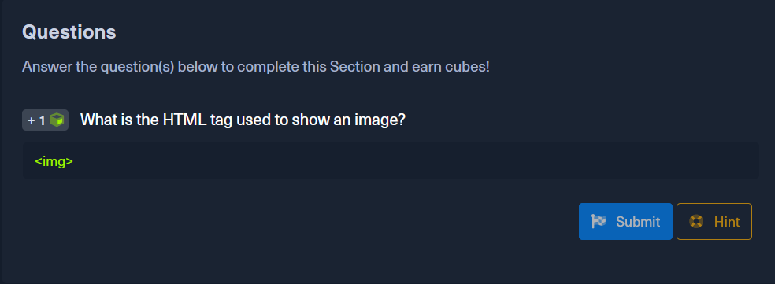

# 题目 2

## 题目

What is the CSS "property: value" used to make an HTML element's text aligned to the left? 

## 解题思路

在浏览器当中按 <kbd>F12</kbd> 、在 Typora 中按 <kbd>Shift</kbd>+<kbd>F12</kbd>、在 Obsidian 中按 <kbd>Ctrl</kbd>+<kbd>Shift</kbd>+<kbd>I</kbd> 打开开发者模式，在“查看器”的样式过滤器中输入 `align` 即可看得到 `text-align: left;` 之类的内容。

## 截图

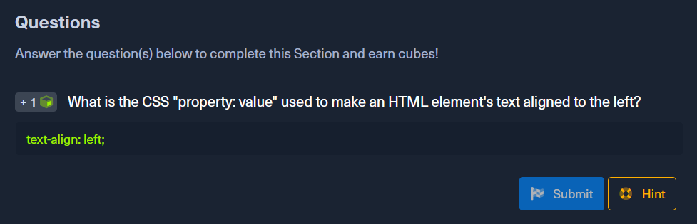

# 题目 3

## 题目

Check the above login form for exposed passwords. Submit the password as the answer.

## 解题思路

查看网页源代码即可。

发现 `<!-- TODO: remove test credentials admin:HiddenInPlainSight -->`，根据 Sensitive Data Exposure 所讲授的内容和例子，我们可以推断冒号后的内容就是测试用例的密码。

## 截图

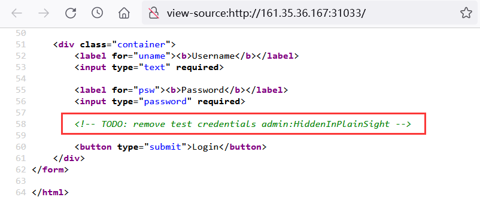

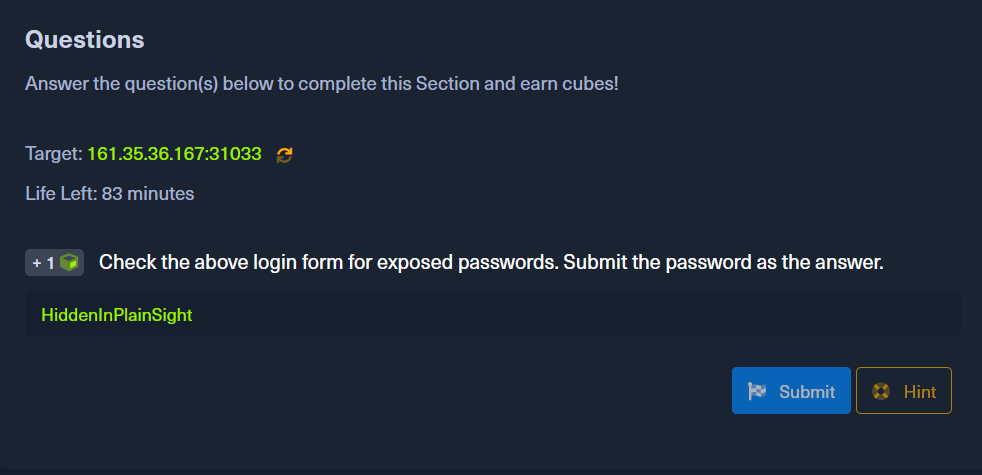

# 题目 4

## 题目

What text would be displayed on the page if we use the following payload as our input: `<a href="http://www.hackthebox.com">Click Me</a>`

## 解题思路

该载荷是一段 HTML 超链接代码，显示在页面上的文本是在开始标签 `<a>` 和结束标签 `</a>` 之间的 `Click Me`，推知最终页面呈现的文本是 `Your name is Click Me`。

在 HTB 的虚拟机中可以证实上述内容。

## 截图

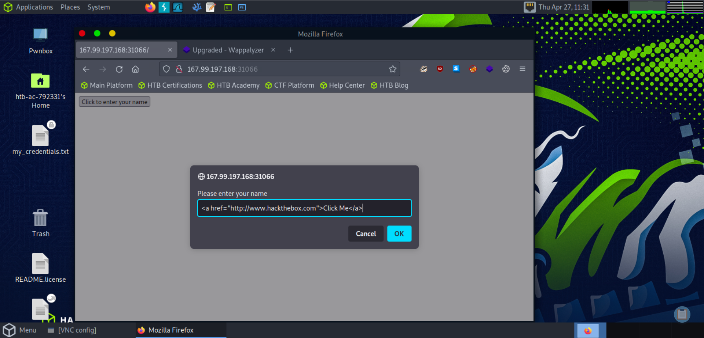

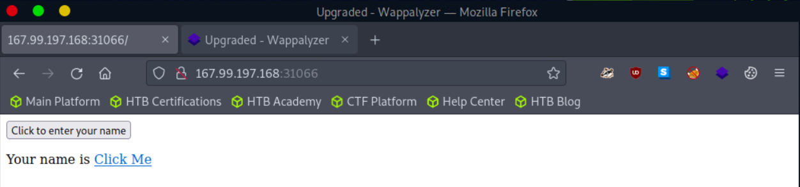

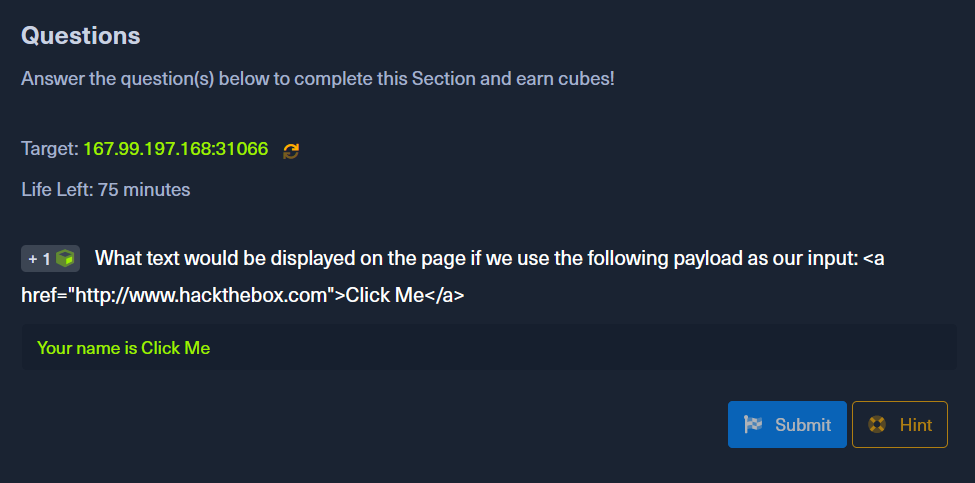

# 题目 5

## 题目

Try to use XSS to get the cookie value in the above page

## 解题思路

教程当中已经给出弹出 cookie 的 XSS 攻击载荷，在虚拟机中输入并确认即可弹窗显示 cookie 内容。`` 表示在页面中插入 src 属性为 URL 的图片，但图片不存在，触发 onerror 事件，弹窗显示 cookie 内容。

## 截图

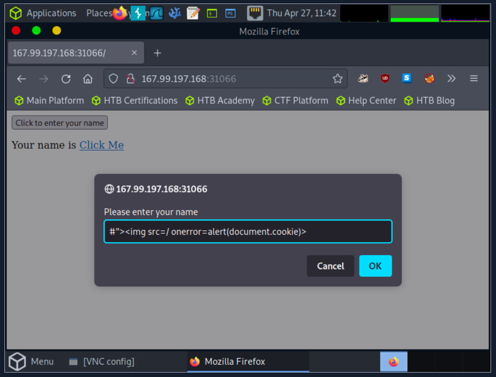

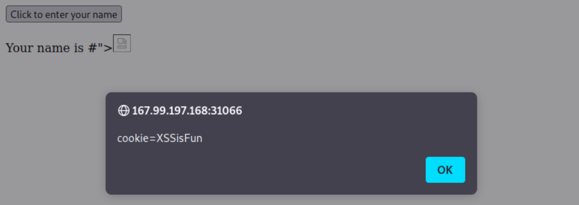

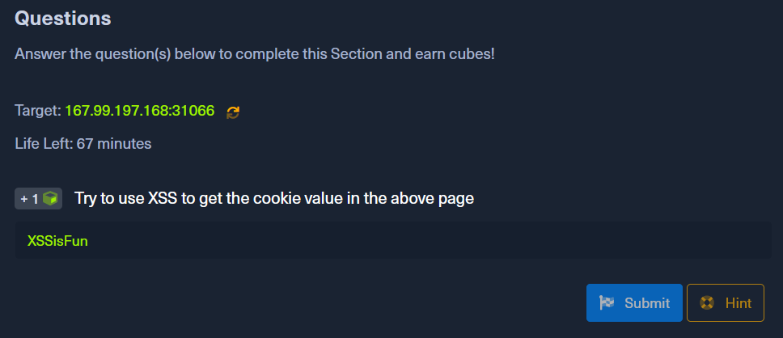

# 题目 6

## 题目

What operating system is 'WAMP' used with?

## 解题思路

阅读教程可知，WAMP 组合由 Windows、Apache、MySQL 和 PHP 这四个后端组件‌组成，即 Windows Apache Mysql PHP 集成环境。因此 WAMP 使用的操作系统是 Windows。

## 截图

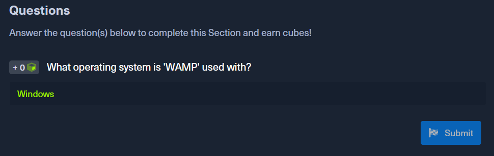

# 题目 7

## 题目

If a web server returns an HTTP code 201, what does it stand for?

## 解题思路

查阅 [HTTP response status codes](https://developer.mozilla.org/en-US/docs/Web/HTTP/Status) 可知，201 表示 `Created`，即请求成功，创建了一个新资源。这通常是在 `POST` 请求或某些 `PUT` 请求之后发送的响应。

## 截图

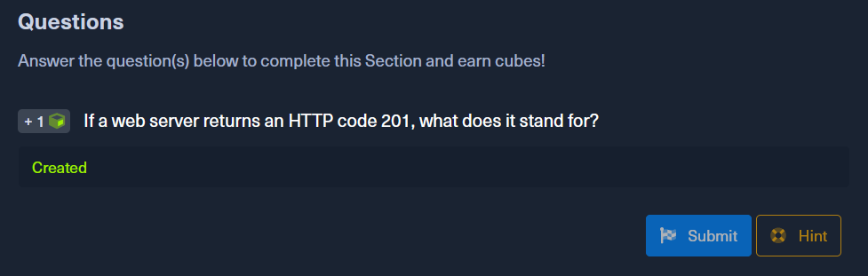

# 题目 8

## 题目

What type of database is Google's Firebase Database?

## 解题思路

查询谷歌可得到结果：

> The Firebase Realtime Database is a **cloud-hosted NoSQL database** that lets you store and sync data between your users in realtime.

## 截图

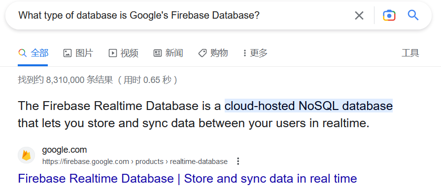

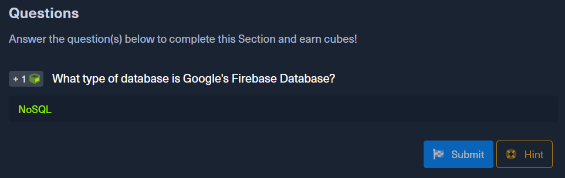

# 题目 9

## 题目

Use GET request '/index.php?id=0' to search for the name of the user with id number 1?

## 解题思路

使用 curl 向题目给出的 URL 发送请求，注意将 `id=0` 改为 `id=1` 即可：
`curl http://161.35.36.167:32228/index.php?id=1`

## 截图

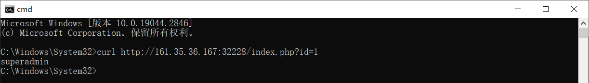

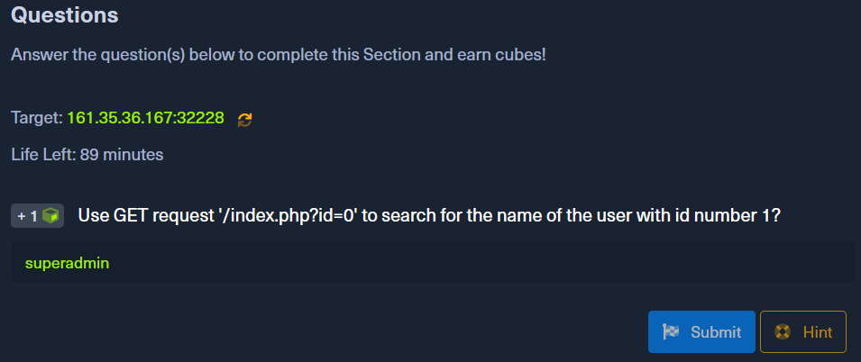

# 题目 10

## 题目

To which of the above categories does public vulnerability 'CVE-2014-6271' belongs to?

## 解题思路

在 [CVE官网](https://cve.mitre.org/) 中查询 CVE-2014-6271，得到如下描述：

> GNU Bash through 4.3 processes trailing strings after function definitions in the values of environment variables, which allows remote attackers to execute arbitrary code via a crafted environment, as demonstrated by vectors involving the ForceCommand feature in OpenSSH sshd, the mod_cgi and mod_cgid modules in the Apache HTTP Server, scripts executed by unspecified DHCP clients, and other situations in which setting the environment occurs across a privilege boundary from Bash execution, aka "ShellShock." 

GNU Bash 中的 CVE-2014-6271“破壳”漏洞的产生原因是：以“(){”开头定义的环境变量在命令 `env` 中解析成函数后，Bash 继续解析并执行函数定义后尾随的字符串中的 shell 命令，核心原因在于在输入的过滤中没有严格限制边界，也没有做出合法化的参数判断。

因此可知 CVE-2014-6271 是命令注入漏洞。

## 截图

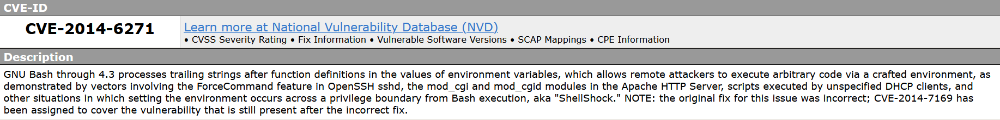

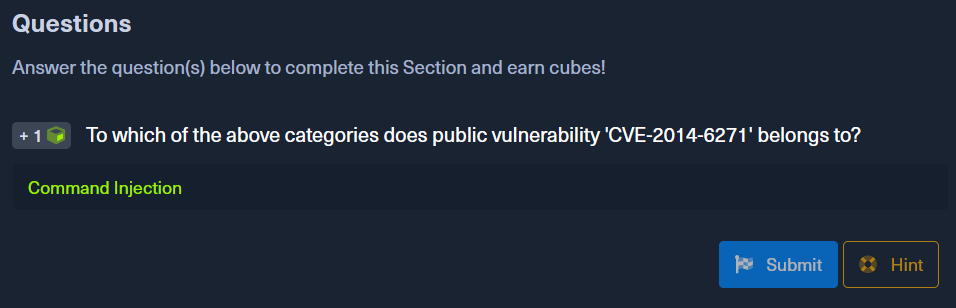

# 题目 11

## 题目

What is the CVSS score of the public vulnerability CVE-2017-0144?

## 解题思路

在 Hint 中提示要求使用 CVSS v2.0 评分。在 [NVD](https://nvd.nist.gov/vuln/detail/CVE-2017-0144) 中查询 CVE-2017-0144，发现其 CVSS v2.0 评分为 9.3。

## 截图

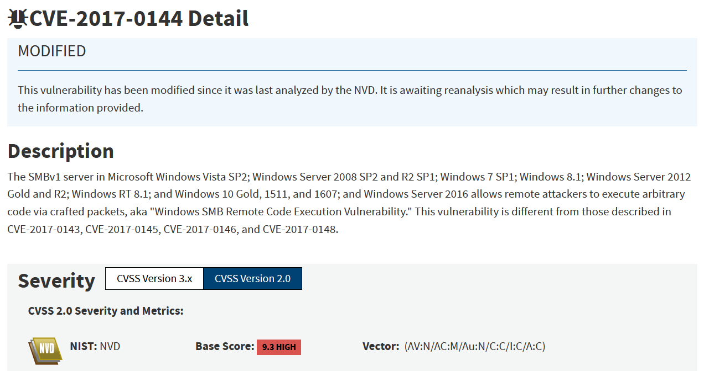

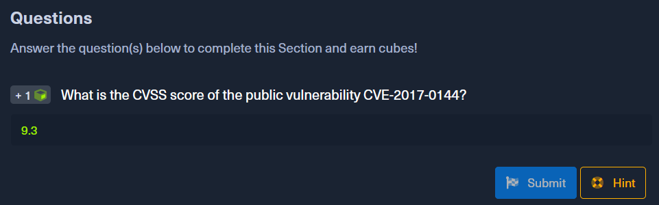

